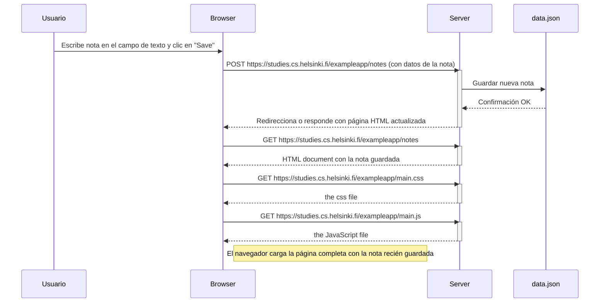

# Diagrama de secuencia para crear una nota en una aplicación tradicional (MPA)

```mermaid
sequenceDiagram
    participant Usuario
    participant Browser
    participant Server
    participant data.json

    Usuario->>Browser: Escribe nota en el campo de texto y clic en "Save"
    Browser->>Server: POST https://studies.cs.helsinki.fi/exampleapp/notes (con datos de la nota)
    activate Server
    Server->>data.json: Guardar nueva nota
    data.json-->>Server: Confirmación OK
    Server-->>Browser: Redirecciona o responde con página HTML actualizada
    deactivate Server

    Browser->>Server: GET https://studies.cs.helsinki.fi/exampleapp/notes
    activate Server
    Server-->>Browser: HTML document con la nota guardada
    deactivate Server

    Browser->>Server: GET https://studies.cs.helsinki.fi/exampleapp/main.css
    activate Server
    Server-->>Browser: the css file
    deactivate Server

    Browser->>Server: GET https://studies.cs.helsinki.fi/exampleapp/main.js
    activate Server
    Server-->>Browser: the JavaScript file
    deactivate Server

    Note right of Browser: El navegador carga la página completa con la nota recién guardada
```
