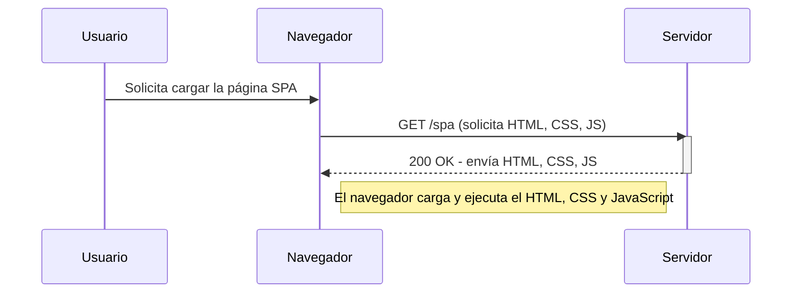

Ejercicio 05: Flujo de carga de la página en una Single Page Application (SPA) `cart.json`.

```mermaid
sequenceDiagram
    participant Usuario
    participant Navegador
    participant Servidor

    Usuario->>Navegador: Solicita cargar la página SPA
    Navegador->>Servidor: GET /spa (solicita HTML, CSS, JS)
    activate Servidor
    Servidor-->>Navegador: 200 OK - envía HTML, CSS, JS
    deactivate Servidor

    Note right of Navegador: El navegador carga y ejecuta el HTML, CSS y JavaScript
```
