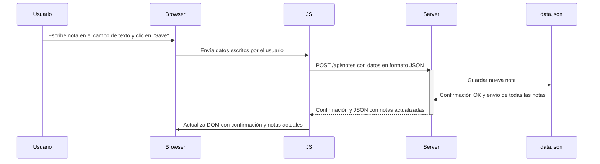

# Diagrama de secuencia para crear una nota en una aplicación de una sola pagina  (SPA)

```mermaid
sequenceDiagram
    participant Usuario
    participant Browser
    participant JS
    participant Server
    participant data.json

    Usuario->>Browser: Escribe nota en el campo de texto y clic en "Save"
    Browser->>JS: Envía datos escritos por el usuario
    JS->>Server: POST /api/notes con datos en formato JSON
    activate Server
    Server->>data.json: Guardar nueva nota
    data.json-->>Server: Confirmación OK y envío de todas las notas
    Server-->>JS: Confirmación y JSON con notas actualizadas
    deactivate Server
    JS->>Browser: Actualiza DOM con confirmación y notas actuales
```
